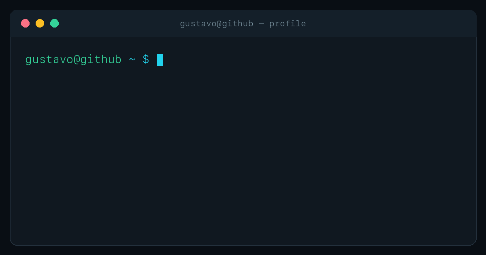

### Full-stack developer · SaaS · Automações · IA

Construo produtos que conectam interfaces claras, backends robustos e integrações que funcionam em produção.

 

 
 

<picture>
  <source media="(prefers-color-scheme: dark)" srcset="https://raw.githubusercontent.com/GusMenezes/GusMenezes/output/github-contribution-grid-snake-dark.svg" />
  
</picture>

